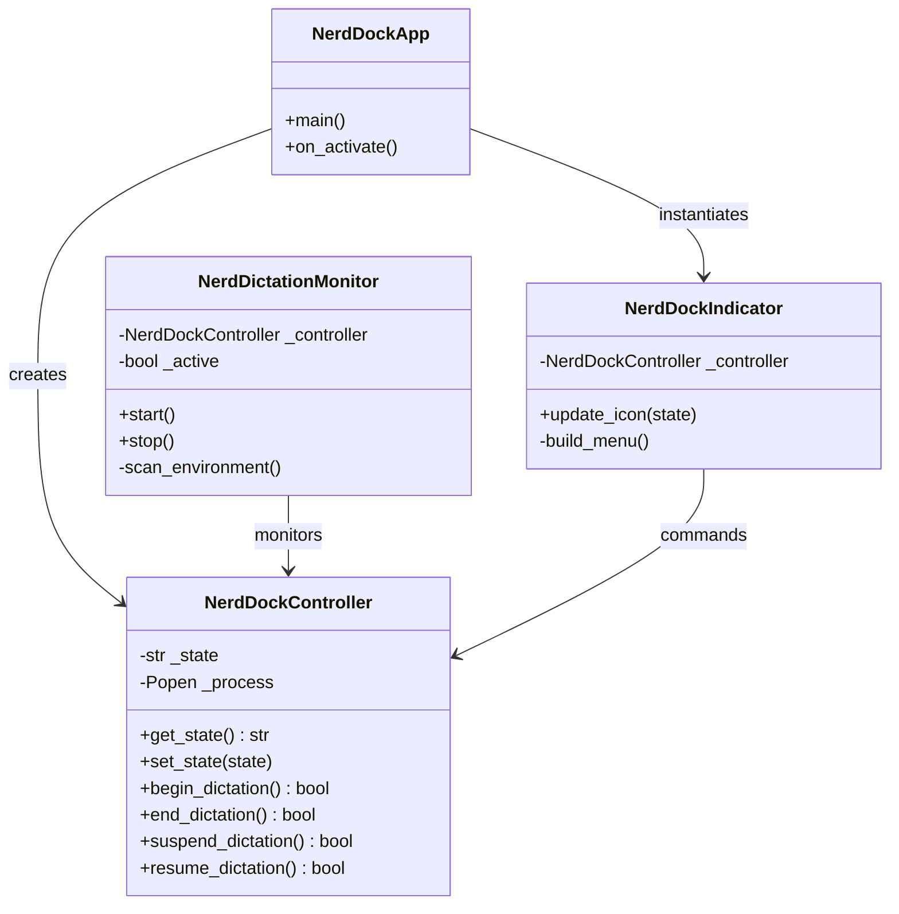

# Architecture Design Document — Nerd-Dock

**Author:** Morpheus (Tech Lead & Architect)  
**Date:** 2026-05-20  
**Status:** Approved for Implementation  

---

## 1. Package Structure
```
nerd-dock/
├── Makefile.prj             # Project automation script
├── pyproject.toml           # PEP 518 build system & dependencies
├── nerd_dock/
│   ├── __init__.py          # Module exports
│   ├── main.py              # Application entry point
│   ├── controller.py        # Subprocess manager and state machine
│   ├── monitor.py           # Cookie and process scanner
│   └── ui_indicator.py      # Ayatana AppIndicator tray applet
└── tests/
    ├── __init__.py
    ├── test_controller.py   # State machine tests
    └── test_monitor.py      # Cookie monitor tests
```

---

## 2. Component Design

### 2.1. NerdDockController (`controller.py`)
Responsible for executing the subprocess subcommands and keeping track of the local system state.
- **Attributes:**
  - `_state: str` - Current state (`STOPPED`, `RECORDING`, `SUSPENDED`, `TRANSITIONING`).
  - `_process: subprocess.Popen` - Active subprocess handler when spawned by the applet.
- **Public Methods:**
  - `get_state() -> str`
  - `set_state(state: str)`
  - `begin_dictation(options: list = None) -> bool` - Launches `nerd-dictation begin`.
  - `end_dictation() -> bool` - Launches `nerd-dictation end`.
  - `suspend_dictation() -> bool` - Launches `nerd-dictation suspend`.
  - `resume_dictation() -> bool` - Launches `nerd-dictation resume`.
  - `cancel_dictation() -> bool` - Launches `nerd-dictation cancel`.
- **Logic Safeguards:**
  - Double execution prevention: If state is already `RECORDING`, calling `begin_dictation` is a no-op.
  - State locks: Sets state to `TRANSITIONING` during subprocess spawning/killing to avoid UI click race conditions.

### 2.2. NerdDictationMonitor (`monitor.py`)
A low-overhead, thread-safe background scanner that polls the environment.
- **Attributes:**
  - `_controller: NerdDockController` - Core coordinator.
  - `_active: bool` - Thread running state.
  - `_callback: callable` - UI update notifier.
- **Operations (Runs every 250ms):**
  1. Checks if `/tmp/nerd-dictation.cookie` exists.
  2. If the cookie exists, reads the PID stored inside it.
  3. Checks if the PID is active in `/proc`. If the process is dead, cleans up the cookie and sets state to `STOPPED`.
  4. Detects if the process is active or suspended by evaluating CPU activity, command status, or file modifications.
  5. Schedules UI updates thread-safely via `GLib.idle_add(callback, new_state)`.

### 2.3. NerdDockIndicator (`ui_indicator.py`)
The Ayatana AppIndicator top-bar tray applet, managing menus, click events, status icons, and tooltips.
- **Dynamic Icons:**
  - `STOPPED` -> Monochrome gray microphone icon.
  - `RECORDING` -> Colored red microphone icon.
  - `SUSPENDED` -> Orange pause/muted circle icon.
- **Tooltips:**
  - Updates the indicator's hover label or status string dynamically on state change.

---

## 3. High-Level Class Relationships



---

## 4. Threading & Thread-Safety Model
GTK is fundamentally **not thread-safe**. Any modifications to widgets or icons from background threads will cause segmentation faults or GUI deadlocks.
- **Rule:** The `NerdDictationMonitor` background worker thread MUST NOT edit GTK/Indicator widgets directly.
- **Solution:** The background thread will schedule UI updates to run on the main GTK thread using `GLib.idle_add`:
  ```python
  # Safe dispatch inside monitor thread
  GLib.idle_add(ui_callback, calculated_state)
  ```
